# SSS Qualifiers - Binary Track:

## 1) Challenge: Black Hole

### 1. Initial Analysis

The file `black_hole` is an x86-64 ELF binary. I opened it in Ghidra to understand what it does. The main function (`FUN_004007b3`) opens `/dev/null` for writing, decrypts something into a buffer, writes it with `fwrite`, then closes the file. The result is intentionally thrown away — hence the challenge name.

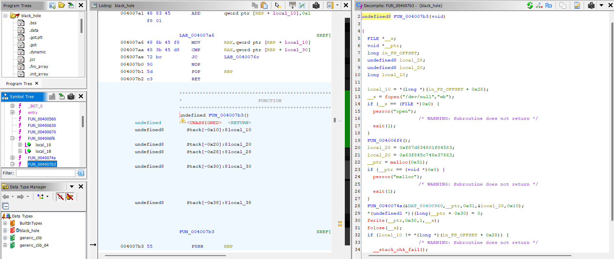

### 2. Spotting the Distractors

Before digging into the crypto, I noticed two things that seemed important but weren't:

- **`FUN_004006f6`** — a function called before decryption. Looking at it in Ghidra, it's just two empty loops, one counting up and one counting down. It does nothing.
- **`fwrite` to `/dev/null`** — the decrypted flag is written straight to `/dev/null`, so running the binary normally produces no output at all.

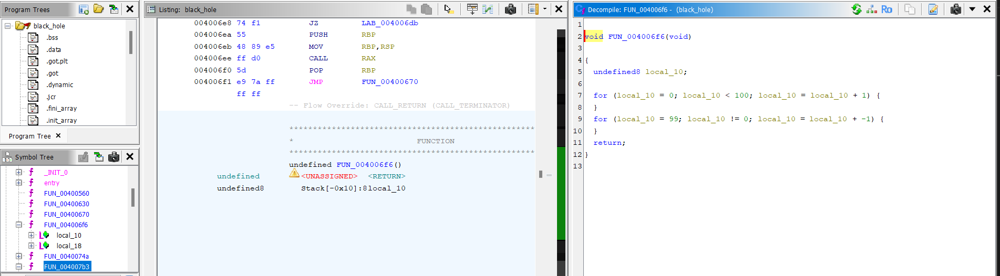

### 3. Getting the Flag

Since the flag is decrypted in memory before being thrown away, I figured I could intercept it at runtime without touching the crypto at all. `ltrace` traces all library calls made by the binary and shows their arguments — including what gets passed to `fwrite`:

```bash
ltrace -s 200 ./black_hole
```

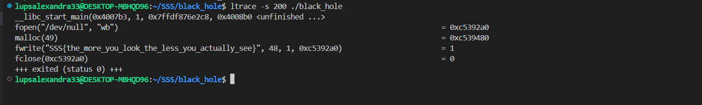

`ltrace` caught the `fwrite` call and printed the buffer contents before they disappeared into `/dev/null`:

```
fwrite("SSS{the_more_you_look_the_less_you_actually_see}", 48, 1, 0xc5392a0)                       = 1
```

#### Flag: `SSS{the_more_you_look_the_less_you_actually_see}`

---

## Tools Used
- **Ghidra:** Static analysis to understand the binary structure and identify the distractors.
- **ltrace:** Runtime library call tracing to intercept the flag before it was written to `/dev/null`.


## 2) Challenge: One by one
### 1. Initial Analysis
I started by performing static analysis on the ELF binary using Ghidra. At first glance, the main function appeared to be a dead end, only executing a **puts("Hello, world!")** statement. After testing this string on CyberEDU and confirming it was a decoy, I expanded my search beyond the standard execution flow.

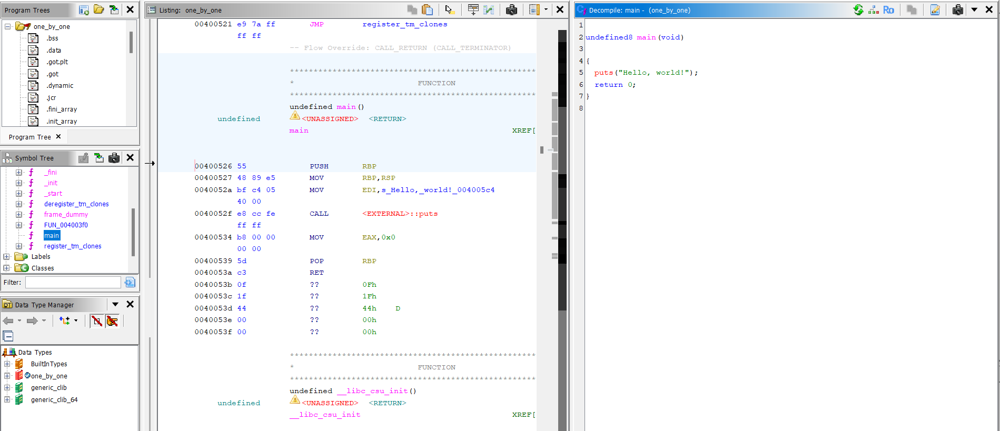

### 2. Identifying the Pattern
Since the binary was stripped, I manually inspected the Symbol Table and discovered an unusual sequence of global variables labeled ``part0`` through ``part27``. This naming convention strongly suggested that the flag was not stored as a single contiguous string, but rather fragmented into individual characters across the data section.

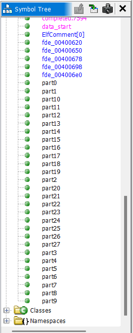

### 3. Reconstruction
I navigated to the Labels folder in Ghidra to locate these variables in the memory map. By analyzing the hexadecimal values assigned to each part, I cross-referenced them with the ASCII table to extract their character equivalents.

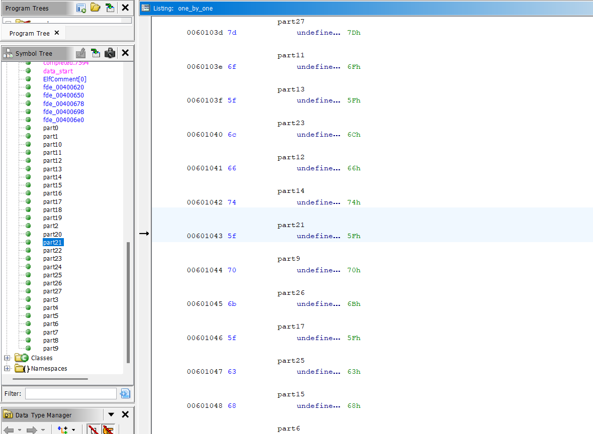

### 4. Final Solution
By reassembling these 28 characters in their indexed order (part0 → part27), I successfully reconstructed the hidden flag. This challenge highlighted the importance of looking beyond the main function and investigating the binary's data structures for obfuscated information.

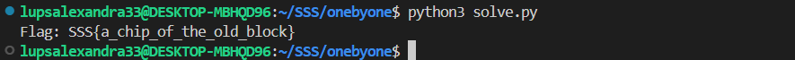

#### Flag: ``SSS{a_chip_of_the_old_block}``

## Script
I developed a Python solver using the ``pwntools`` library. This script programmatically parses the ELF symbol table, extracts the byte-value for each 'partX' variable, and reconstructs the flag in the correct indexed order.

## Tools Used
- **Ghidra:** The primary tool for static analysis, used to decompile the binary and explore the Symbol Tree to locate the hidden data fragments.
- **GDB (GNU Debugger):** Utilized for dynamic analysis to step through the execution and verify that the main function was indeed a decoy.

## 3) Challenge: Pinpoint
### 1. Initial Analysis (Static Analysis)
Using Ghidra, I performed a static analysis of the stripped ELF binary. Despite the absence of symbol tables, I was able to isolate the main function by analyzing the program's control flow. The decompiled code revealed a specific logic flow that handles user input and memory modification:

1) The program initializes a global variable **v** with a default value.
2) It prompts the user for a memory address (address to write to) and a single-byte value (value to write).
3) The program then performs a direct pointer dereference to write the user-supplied byte to the specified address: ``*local_18 = local_19;``.
4) A conditional check follows: if the global variable **v** equals the hexadecimal constant ``0x53585353``, the program executes ``system("/bin/sh")``.

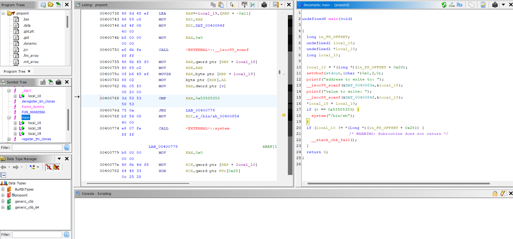

### 2. Memory Investigation & Debugging
To determine the precise memory layout, I transitioned to dynamic analysis using **GDB** with the **Pwndbg** extension. The objective was to locate the global variable v and inspect its state during runtime. By querying the symbol table with ``p &v``, I identified its base address at **0x601058**.

Using the examine command ``x/4bx 0x601058``, I verified the current buffer content, which consisted of **four contiguous bytes of 0x53 (ASCII: SSSS)**. Comparing this against the **target condition of 0x53585353 (SSXS)**, I confirmed that the program's logic could be subverted by modifying a single byte. Due to the Little-Endian storage mechanism utilized by the x86_64 architecture, the byte requiring modification was located at an **offset of +2** from the base address.

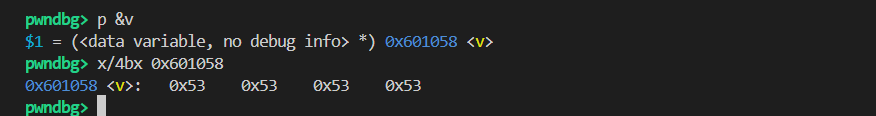

### 3. Exploitation Strategy
The exploitation phase required a precise write to the calculated offset to satisfy the if condition. The target address was determined to be ``0x60105a`` (0x601058 + 2). To ensure compatibility with the scanf input requirements and to prevent parsing errors often associated with hex-encoded strings, I converted the tactical parameters into their decimal equivalents.

The memory address 0x60105a was translated to ``6295642``, while the required value 0x58 (the ASCII representation of 'X') was provided as ``88``. Upon submitting these parameters to the remote server, the write operation was successfully executed, aligning the variable v with the required constant. This triggered the ``system("/bin/sh")`` call, granting unauthorized shell access to the remote environment.

### 4. Solution & Flag Retrieval
I connected to the remote challenge server using netcat: ``nc 141.85.224.101 31301``.
By providing the calculated decimal address and the target byte value, I successfully hijacked the program's logic. The server validated the memory modification and spawned a shell.

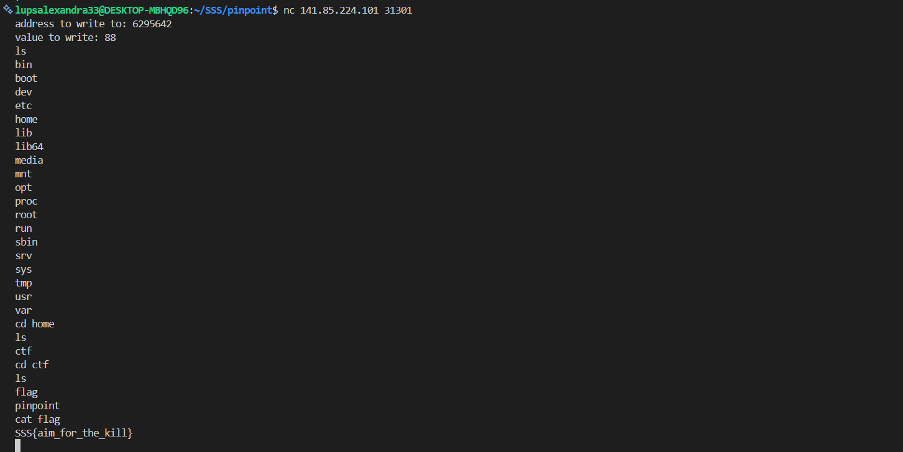

#### Flag: ``SSS{aim_for_the_kill}``

## Tools Used
- **Ghidra:** For deep static analysis and identifying the arbitrary write vulnerability.
- **GDB + Pwndbg:** For memory mapping, identifying global variable offsets, and verifying Little-Endian storage.
- **Netcat (nc):** For remote server exploitation.


## 4) Challenge: Mirror Me
### 1. Initial Analysis (Static Analysis)
Using Ghidra, I performed a static analysis of the binary. The main function revealed a logic gate based on user input:

1) The program prompts for two separate numbers using fgets.
2) These inputs are converted to integers via atoi.
3) The product of these two integers is compared against the return value of a function named max_mirror().
4) If the comparison is successful, the program executes system("/bin/sh"), granting a remote shell.

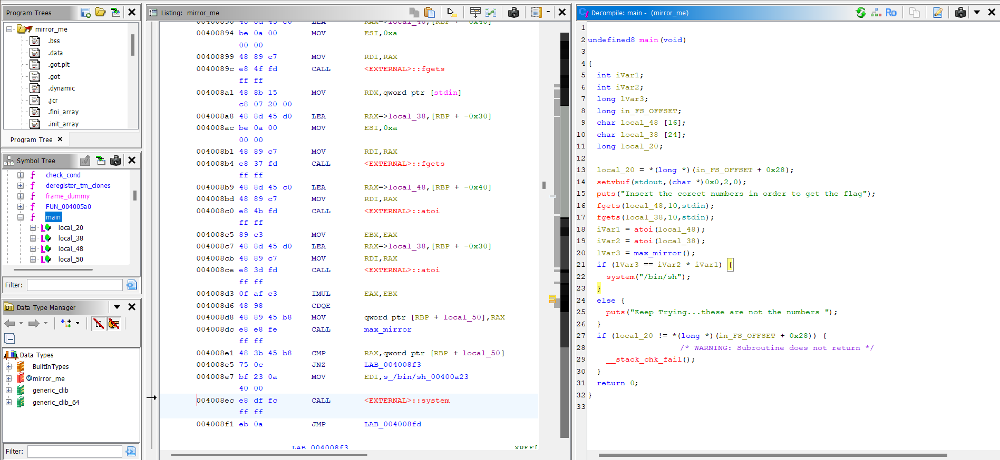

### 2. Algorithmic Investigation
The ``max_mirror()`` function was analyzed to understand the underlying mathematical requirement. The decompiled code showed a nested loop structure designed to calculate the largest palindrome resulting from the product of two 3-digit numbers. A string hint found in the binary's data section confirmed this:

***"find the 3digits numbers whose product = maximum mirrored number"***

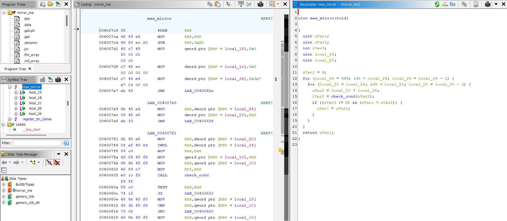

### 3. Dynamic Debugging (GDB / Pwndbg)
To bypass the time-consuming loops of the max_mirror() function during execution, I used ``GDB`` with the ``Pwndbg`` plugin: I set a breakpoint at the return instruction of ``max_mirror()`` and executed the program and inspected the RAX register once the function completed. The register contained the hexadecimal value **0xdd571**, which translates to **906609** in decimal.

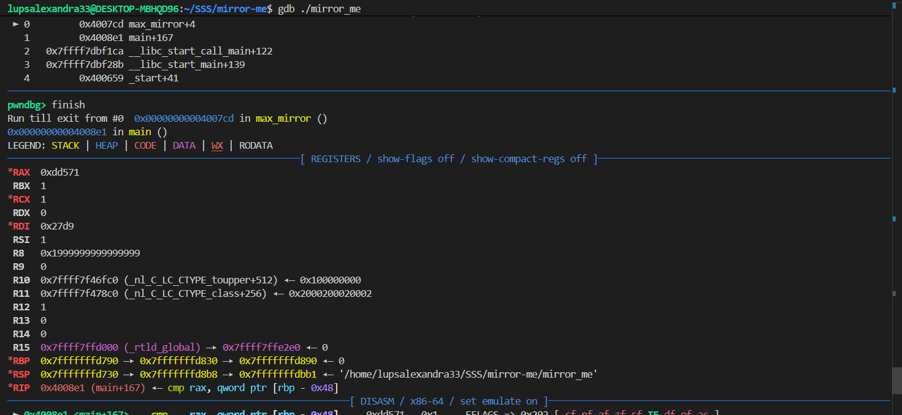
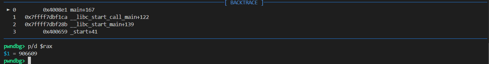

### 4. Solution & Exploitation
The number **906609** is the product of **913** and **993**.
I used netcat to connect to the challenge server: ``nc 141.85.224.101 31300``. I provided 913 as the first input and 993 as the second. The server validated the product and opened a shell. Navigating the remote file system with ls and cat, I located and read the ``flag`` file.

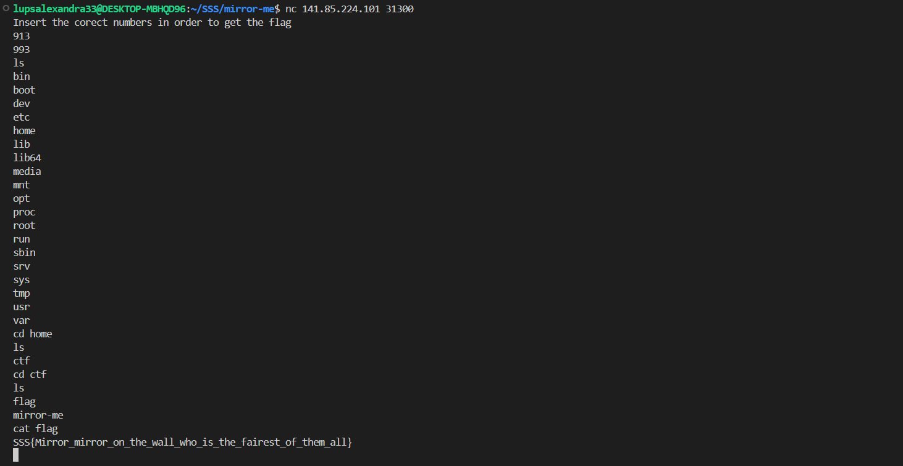

#### Flag: ``SSS{Mirror_mirror_on_the_wall_who_is_the_fairest_of_them_all}``

## Tools Used
- **Ghidra:** For decompilation and logical flow analysis.
- **GDB + Pwndbg:** For dynamic register inspection and bypassing heavy loops.
- **Netcat (nc):** For remote server exploitation.

## 5) Challenge: Not Backdoor

### 1. Initial Analysis
The file not_backdoor.exe was initially identified as a container, rather than a standalone executable. To access the actual binary, I had to extract it using the command:

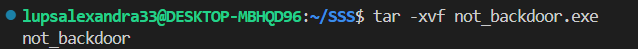

This extraction revealed an x86-64 ELF binary. Static analysis in Ghidra showed that the main function expects a single numeric command-line argument, which is converted via atoi and used as a XOR key in the decryption function **FUN_004006b6**.

### 2. Identifying the Encryption Logic
Inside the decoding function, I discovered a local byte array (**local_38**) initialized with 28 hexadecimal values (e.g., 0x3c, 0x3c, 0x3c, 0x14...). The function then executes a for loop that performs a bitwise ``XOR operation`` between each element of the array and the user-provided key. The final result is printed to the console as the flag.

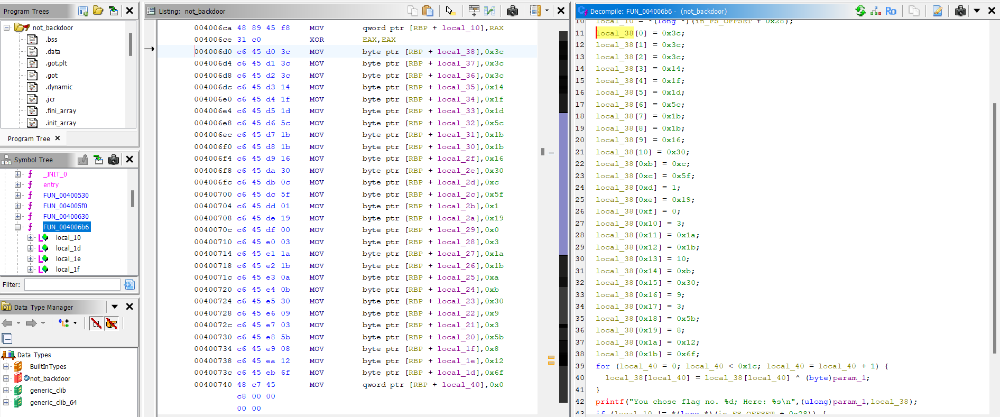

### 3. Key Discovery (String Termination Logic)
To find the correct key without brute-forcing, I analyzed the memory management of strings in C. I observed that the last byte assigned to the array is ``local_38[0x1b] = 0x6f``. Since a valid C string must end with a **null terminator (0x00)**, the XOR operation at the last index must result in zero:
- $local\_38[0x1b] \oplus key = 0$
- $0x6f \oplus key = 0 \implies key = 0x6f$

The hexadecimal value 0x6f translates to 111 in decimal. This was further confirmed by the fact that using 111 as a key transforms the first three bytes (0x3c) into 0x53 (ASCII 'S'), matching the known **SSS flag prefix**.

### 4. Final Solution
I executed the binary by providing the derived key as an argument: ``./not_backdoor.exe 111``. The program successfully decrypted the internal buffer and revealed the hidden flag.

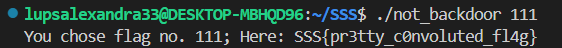

#### Flag: ``SSS{pr3tty_c0nvoluted_fl4g}``

## Tools Used
- **Ghidra:** Used for static analysis to decompile the binary and extract the encrypted byte array and XOR logic.

## 6) Challenge: The Talker

### 1. Initial Analysis
The binary `the_talker` was analyzed using **Ghidra** to understand its behavior without executing it.
Static analysis revealed two key functions: `main` and `read_flag`.

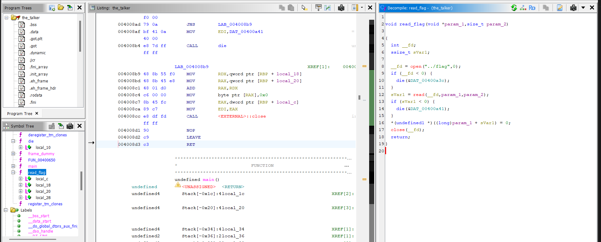

The `read_flag` function opens a file located at `../flag` (one directory above the binary's
working directory), reads its contents into a buffer of up to 128 bytes, and null-terminates
the result.

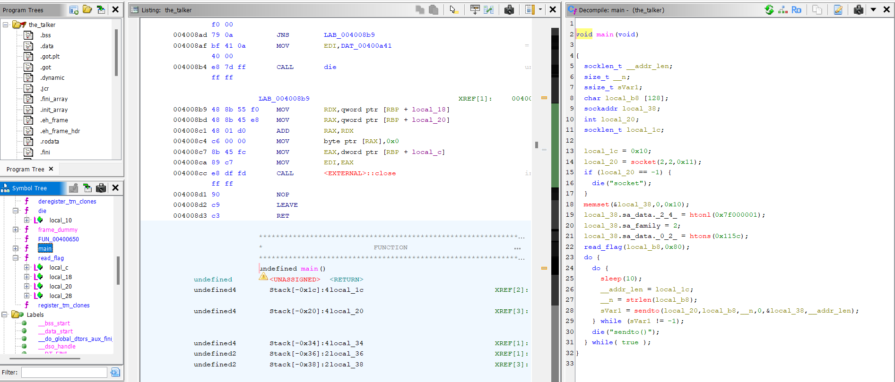

### 2. Understanding the Network Behavior
Inside the `main` function, I identified the following logic:
- A **UDP socket** is created using the call `socket(2, 2, 0x11)`, where:
  - `2` (`AF_INET`) specifies IPv4
  - `2` (`SOCK_DGRAM`) specifies a datagram socket — confirming **UDP** (TCP would use `SOCK_STREAM = 1`)
  - `0x11` (decimal `17`) corresponds to `IPPROTO_UDP`, explicitly confirming the protocol
- The destination is hardcoded to **127.0.0.1:4444** (localhost)
  - IP: `0x7f000001` → `127.0.0.1`
  - Port: `0x115c` → `4444`
- The flag is read into a local buffer via `read_flag`
- The buffer is then sent via `sendto()` in an **infinite loop**, with a `sleep(10)` delay
between each transmission

This means the binary continuously broadcasts the flag over **UDP to localhost port 4444**
every 10 seconds — we just need to listen.

### 3. Connecting to the Remote Server
Since the binary reads `../flag` from the server's filesystem and sends it to localhost,
the exploit must be performed **on the remote machine itself**. The challenge provided SSH
credentials to access the server where `the_talker` was already running.

```bash
ssh connect@141.85.224.101 -p 31302
```

### 4. Capturing the Flag
Once connected via SSH, I simply set up a **UDP listener on port 4444** using netcat. No exploitation, patching, or brute-forcing was required. Within 10 seconds, the binary delivered the flag automatically:

```bash
nc -u -l -p 4444
```

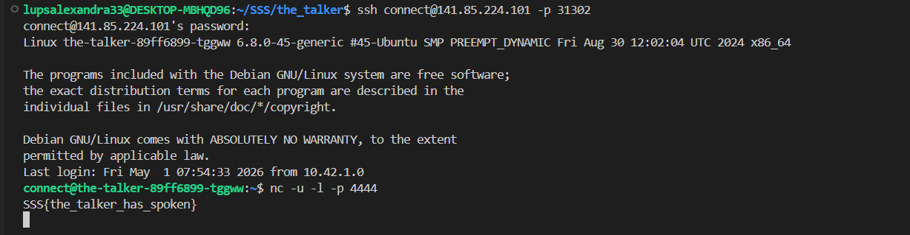

#### Flag: ``SSS{the_talker_has_spoken}``

## Tools Used
- **Ghidra:** Used for static analysis to decompile the binary, identify the UDP socket
setup, destination address/port, and the flag reading logic.
- **SSH:** Used to gain shell access to the remote server where the binary was running.
- **netcat (`nc`):** Used to listen on UDP port 4444 and receive the flag transmitted
by the running binary.
