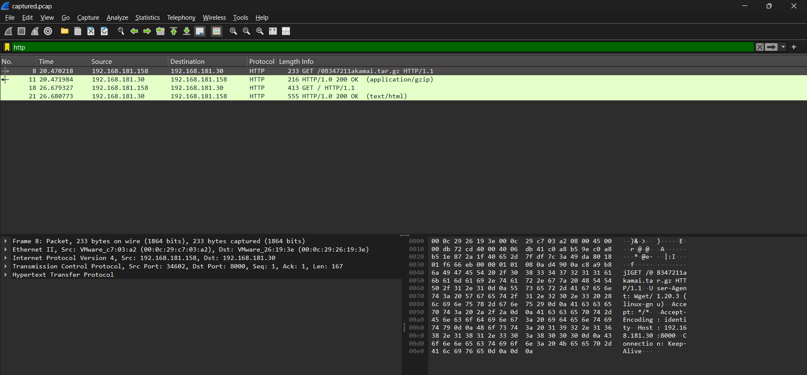
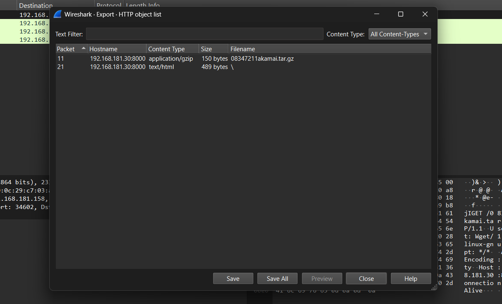
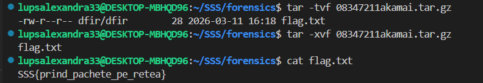
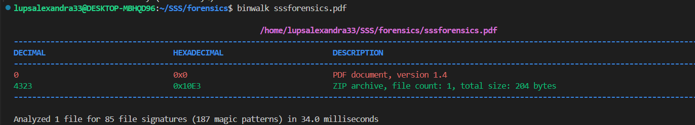
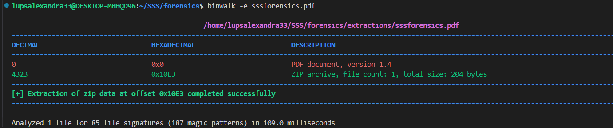

# SSS Qualifiers - Forensics Track:

## 1) Challenge: Operation 1337 Niffler

### 1. Initial Analysis
I started by opening the provided ``.pcap`` file in **Wireshark**. To narrow down the search, I applied an ``http`` filter to look for any unencrypted web traffic. I immediately spotted a suspicious ``GET`` request for an archive named ``08347211akamai.tar.gz``.



### 2. Exporting the Payload
After identifying the ``GET`` request for the archive, I focused on retrieving the transmitted data. In Wireshark, the presence of the application/gzip content type indicated that the file was successfully transferred over the network. To reconstruct the file from the captured packets, I used the Export Objects tool, selected the file ``08347211akamai.tar.gz`` from the list and saved it to my local machine.



### 3. Extraction and Flag Retrieval
Once the archive was saved, I moved to the terminal to see what was hidden inside. I used the ``tar`` command to decompress and extract the contents.

```
tar -xvf 08347211akamai.tar.gz
```
After extraction, I found a file that contained the flag.



#### Flag: ``SSS{prind_pachete_pe_retea}``


## Tools Used
*   **Wireshark:** For packet inspection, protocol filtering, and object exportation.
*   **tar:** For extracting the compressed payload found in the network traffic.


## 2) Challenge: Operation Last Read

### 1. Initial Analysis
The file ``sssforensics.pdf`` appeared to be a standard PDF document. To check for hidden data or embedded files that wouldn't normally show up in a PDF viewer, I used ``binwalk`` to analyze the file signatures.

```
binwalk sssforensics.pdf
```
The analysis revealed a ZIP archive appended to the end of the PDF (at offset 0x10E3), which is a classic indicator of a steganographic overlay.



### 2. Extracting the Hidden Data
To retrieve the hidden archive, I used binwalk with the extract flag. This automatically carves out any identified files from the binary.

```
binwalk -e sssforensics.pdf
```


Navigating into the extracted directory (``sssforensics.pdf.extracted``), I found the ZIP archive and its contents. Inside the archive, there was a file named ``pdf.txt``.

### 3. Getting the Flag
I inspected the contents of the extracted pdf.txt file using the cat command:

```
cat pdf.txt
```
The flag was found directly inside the text file.

#### Flag: ``SSS{poti_sa_te_ascunzi_dar_nu_te_poti_ascunde}``

## Tools Used
- **binwalk:** Used for firmware/file signature analysis and automated extraction of the hidden ZIP overlay.